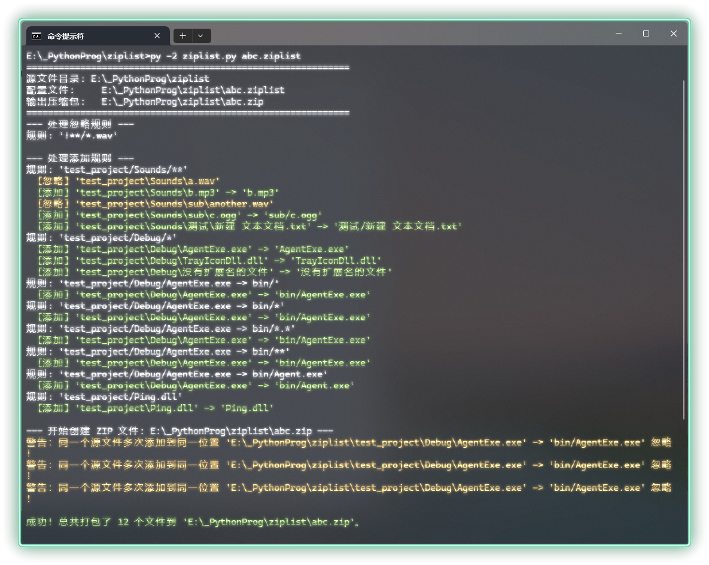

# ziplist.py

一个基于 Python 2.7 的命令行工具，可根据 `.ziplist` 规则文件灵活地批量打包文件到 ZIP 压缩包。

## 功能特点

- 支持递归匹配（`**`）、通配符（`*`）、排除规则（`!` 前缀）。
- 支持文件重命名和路径映射（`源路径 -> 目标路径`）。
- 被排除的文件以黄色字体输出

## 使用方法

1. 编写一个 `.ziplist` 后缀的文件，例如：

   ```
   # 这是一个演示 '!' 忽略语法的 .ziplist 文件

   # 1. 首先，添加 Sounds 目录下的所有内容，保留其内部目录结构。
   #    注意，只有 ** 这种包含嵌套子目录的写法会保留原始目录结构到 zip 文件中。
   test_project/Sounds/**

   # 2. 使用 '!' 定义忽略规则，这里忽略掉所有的 .wav 文件。不管忽略规则先写还是后写，效果都是一样的。
   #    注意 **/*.wav 可以匹配任意子目录下的 .wav 文件
   !**/*.wav

   # 3. 再添加 Debug 目录下的所有文件，但不包括子目录 Level2 里的文件。
   #    注意，如果写 *.* 则不会包括无扩展名的文件。
   test_project/Debug/*

   # 4. 然后，将 Debug 目录下的 AgentExe.exe 再复制一份，注意前面 'Debug/*' 已经添加过它了。
   #    这里我们用一个更精确的规则覆盖它，并给它一个新的目标路径。
   #    有多种不同的写法，也可以给文件重命名 bin/新的文件名.exe。
   test_project/Debug/AgentExe.exe -> bin/
   test_project/Debug/AgentExe.exe -> bin/*
   test_project/Debug/AgentExe.exe -> bin/*.*
   test_project/Debug/AgentExe.exe -> bin/**
   test_project/Debug/AgentExe.exe -> bin/Agent.exe

   # 5. 最后，再添加一个文件。
   #    注意，只要没有使用 -> 定义新的路径，所有文件都会放在 zip 的最外层目录，产生一种平坦化目录结构的效果。
   test_project/Ping.dll
   ```

2. 运行方式：

   ```
   python ziplist.py abc.ziplist
   ```

   会在 `abc.ziplist` 文件所在目录下生成同名的压缩包文件 `abc.zip`。
   
   执行效果：
   
   

## 规则语法

- `pattern` — 添加匹配的文件。
- `!pattern` — 排除匹配的文件。
- `pattern -> target` — 添加并在压缩包中重命名/移动文件。
- 支持 `*`（通配符）、`**`（递归）、注释（`#`）。

## 注意事项

- 若某条添加规则未匹配到文件，工具会提示并退出。
- 压缩包内如有同名目标路径，会警告并覆盖。

## 许可证

[MIT](LICENSE.txt)
